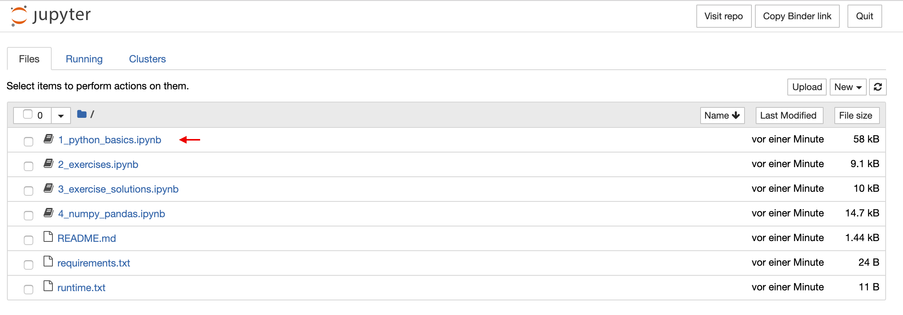
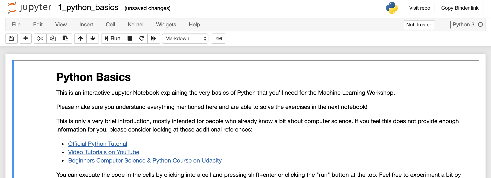
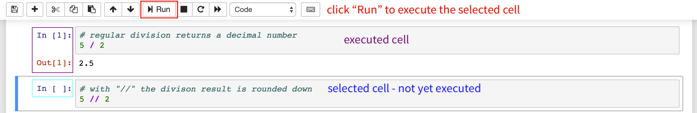

## Python Tutorial

This repository contains Jupyter Notebooks to teach you the basics in Python. The tutorial is a prerequisite for my machine learning course (&rarr; [book](https://franziskahorn.de/mlbook/) and [exercises](https://github.com/cod3licious/ml_exercises)), but should also be helpful in other contexts.

If you want to learn more about software development best practices, have a look at my other book: [Clarity-Driven Development of Scientific Software](https://franziskahorn.de/rsebook/). It also contains a chapter on tools with more information on how to set up your development environment.

### Using Python

This tutorial requires a recent Python installation (at least version 3.8, ideally 3.10 or later) together with Jupyter Notebook and the libraries listed in `requirements.txt`. You can either install these locally on your own machine or work in a preconfigured cloud environment.  
If you're using a company computer, please consult with your IT department.

#### Working on your own computer
- Download the contents of this repository (by clicking the green "Code" button at the top and then "Download ZIP").
- Install Python either directly from the [official website](https://www.python.org/downloads/) or using [uv](https://docs.astral.sh/uv/guides/install-python/) (recommended) in case you need to manage multiple Python version in parallel on your machine. A recent version (Python 3.10 or later) is recommended.
- Install the required dependencies (i.e., additional libraries like `numpy`):
    - Option 1: Global installation using the Python package manager [pip](https://pip.pypa.io/en/stable/getting-started/), e.g., by calling `pip install -r requirements.txt` from a terminal in the repository folder to install all dependencies listed in the `requirements.txt` document.
    - Option 2 (recommended): Installation in an isolated virtual environment using [uv](https://docs.astral.sh/uv/): Install `uv` itself (see [here](https://docs.astral.sh/uv/getting-started/installation/)) and then execute `uv sync` in the repository folder to install the dependencies from the `pyproject.toml` or `uv.lock` file. Activate the virtual environment with `source .venv/bin/activate`.
- In either case should now have [Jupyter Notebook](https://docs.jupyter.org/en/latest/) installed, which you can open from the terminal with `jupyter notebook`, which should then open in the browser. Navigate to the repository folder and click on the first notebook to get started.

#### Working in the cloud
If you can't or don't want to install Python on your own computer, you can also work in an online version of Jupyter Notebook powered by MyBinder by clicking here:  (right-click to open in a new tab; might take a while to launch).  
Alternatively, you can also open the notebooks in **Google Colab**, which is faster, but requires a Google account:

### Getting started
When starting Jupyter Notebook, you should see something similar to this (on your local computer you might need to navigate to the correct folder first):

Start with `1_python_basics.ipynb`, which contains the introductory Python tutorial. Just click on it and a new tab with the notebook should open:

The tutorial is interactive, i.e., you are supposed to execute the code yourself and experiment with the given examples to better understand what is going on. To execute a so-called "cell" with code in it, make sure the cell is selected (has a colored border around it), and click the "run" button (or press "shift"+"enter" on your keyboard). After the cell was successfully executed, the `In [ ]:` next to it will change to something like `In [5]:`.

Go through all the cells from top to bottom, execute them and make sure you understand what happens!

After you're done with the first notebook, look at `2_exercises.ipynb`, which contains some exercises that you should complete. The solutions to these exercises can be found in `3_exercise_solutions.ipynb` (but try to solve them on your own first!).

When you're comfortable with the basics, have a look at `4_numpy_pandas.ipynb`, which gives a quick introduction to the basic data science Python libraries numpy, pandas, and matplotlib. These will be especially important to solve the machine learning exercises, so **even if you already feel comfortable with Python, please work through this part of the tutorial anyways!**
If you haven't worked with vectors and matrices in a while, you might want to refresh your memory on some [linear algebra basics](https://franziskahorn.de/mlws_resources/math_basics.pdf).

If you have any questions, please send me an [email](mailto:hey@franziskahorn.de).

Have fun!
